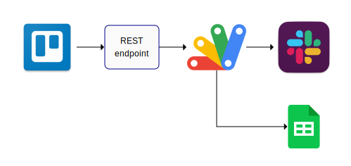

# Status Update Service

By: Ansel Robateau  
robaone@gmail.com

## Context

This project was born out of a desire to reduce friction between working and keeping the group informed.
In October 2020, the development team was stretched thin and we were struggling to coordinate with each other.
As a group we committed to over communicate in the #dev Slack channel.
I find it easier to keep my own notes and stay focused on the task at hand.  I would like to automate the
rest of it so that I don't get distracted.  My note taking tool of choice is Trello.  I decided to create a
Slack bot that will announce what I'm working on as I change tasks.

## Solution

1. Create a Trello webhook that will get activity from a personal trello board.
2. Create a logger that will store a history of activity.
3. Create a Slack bot that will post status messages to the #dev channel for each unique task (card).

## Implementation

The bot is written using the following technologies

* php endpoint that captures the webhook POST requests and forwards it to a web service
   - Source code in `php` folder

* a web service written in Google Apps Script that logs to a Google spreadsheet and posts to Slack
   - Source code in `gapps` folder

